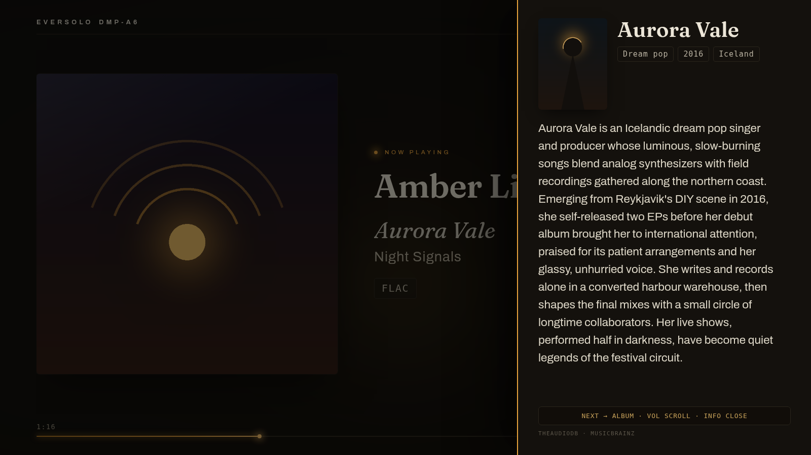
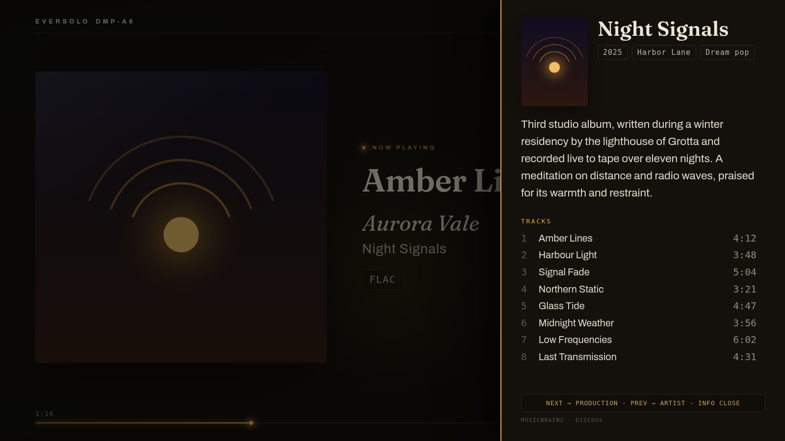
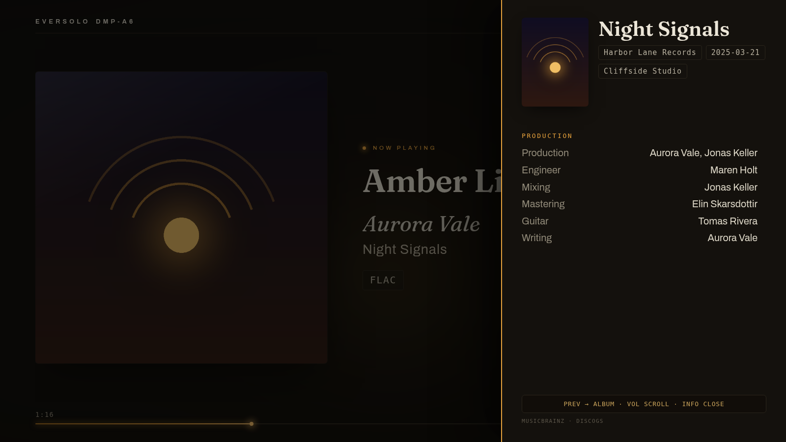

# eversolo-screen

Pantalla « now playing » para streamers Eversolo (DMP-A6, A8, A10) en Raspberry Pi + pantalla HDMI. Carátula, título, calidad de audio, biografías de artistas y créditos de producción, con mando infrarrojo.

[Français](README.md) · [English](README.en.md) · [Deutsch](README.de.md)


| Página del artista | Página del álbum | Página de producción |
|---|---|---|
|  |  |  |

*Interfaz mostrada en inglés, disponible en francés, inglés, español y alemán.*

## Funciones

- Carátula, título, artista, álbum, progreso, reloj, ambiente de color derivado de la carátula
- Calidad de audio: frecuencia, profundidad, tasa de bits (formatos reales de Eversolo)
- Panel de información de 3 páginas: biografía del artista, álbum (descripción, pistas, duraciones), producción (créditos, sello, estudios)
- Mando infrarrojo por aprendizaje: 7 acciones emparejables con cualquier mando
- Emisor infrarrojo opcional: la Pi aprende y reemite comandos hacia la TV o el amplificador
- Modo quiosco al arrancar, administración protegida por contraseña
- 4 idiomas: francés, inglés, español, alemán
- Actualización con un clic desde la interfaz

## Hardware

| Elemento | Mínimo | Recomendado |
|---|---|---|
| Raspberry Pi | Pi 3 | Pi 4, 2 GB |
| Tarjeta SD | 16 GB | Clase A1 |
| Alimentación | | Oficial Raspberry |
| Red | Wi-Fi | Ethernet |
| Receptor IR (opcional) | VS1838B o TSOP38238 | |
| LED IR (opcional) | LED 940 nm + resistencia 220 Ω | Módulo KY-005 |

El Eversolo se controla por red (API puerto 9529): ningún sensor en el streamer.

## Instalación

### Automática (recomendada)

1. Raspberry Pi Imager: Raspberry Pi OS Lite 64 bits, SSH activado, autenticación por contraseña
2. Con la tarjeta aún montada:

```bash
curl -O https://raw.githubusercontent.com/kofekod23/eversolo-screen/main/tools/prepare-sd.sh
bash prepare-sd.sh
```

3. Arrancar la Pi. Tras 10 a 15 minutos, abrir `http://IP_DE_LA_PI:8080`: el asistente detecta el Eversolo y crea la contraseña de administración.

### Manual (SSH)

```bash
sudo apt update && sudo apt install -y git
git clone https://github.com/kofekod23/eversolo-screen.git
cd eversolo-screen && ./install.sh --kiosk --ir
sudo reboot
```

Opciones acumulables: `--kiosk` (pantalla TV), `--ir` (receptor del mando), `--ir-tx` (emisor), `--ram` (registros y cachés en RAM, protege la tarjeta SD).

## Mando

`http://IP_DE_LA_PI:8080/remote`: esquema de cableado del sensor, testigo de detección, prueba en vivo, emparejamiento de las 7 acciones. Con el panel abierto, las teclas de volumen desplazan el texto y las de pista pasan las páginas.

## Fuentes de datos

| Dato | Fuentes |
|---|---|
| Identidad de artista y álbum | MusicBrainz (el álbum en curso resuelve los homónimos) |
| Biografías | TheAudioDB, Last.fm, Wikipedia vía Wikidata |
| Pistas, créditos, estudios | MusicBrainz, Discogs, Genius (pista en curso) |

Todo funciona sin ninguna clave. Claves opcionales en `/config`: Last.fm (gratuita), Discogs (token personal gratuito), TheAudioDB.

## Actualización

Botón en `/config` cuando hay nueva versión, o por SSH: `./update.sh`. Configuración y contraseña preservadas.

## Licencia

[CC BY-NC-SA 4.0](LICENSE.es.md): uso y modificación libres, venta y monetización prohibidas.

## Solución de problemas

Guía completa paso a paso (francés): [INSTALL.md](INSTALL.md). Contraseña olvidada: `venv/bin/python tools/motdepasse.py`.
